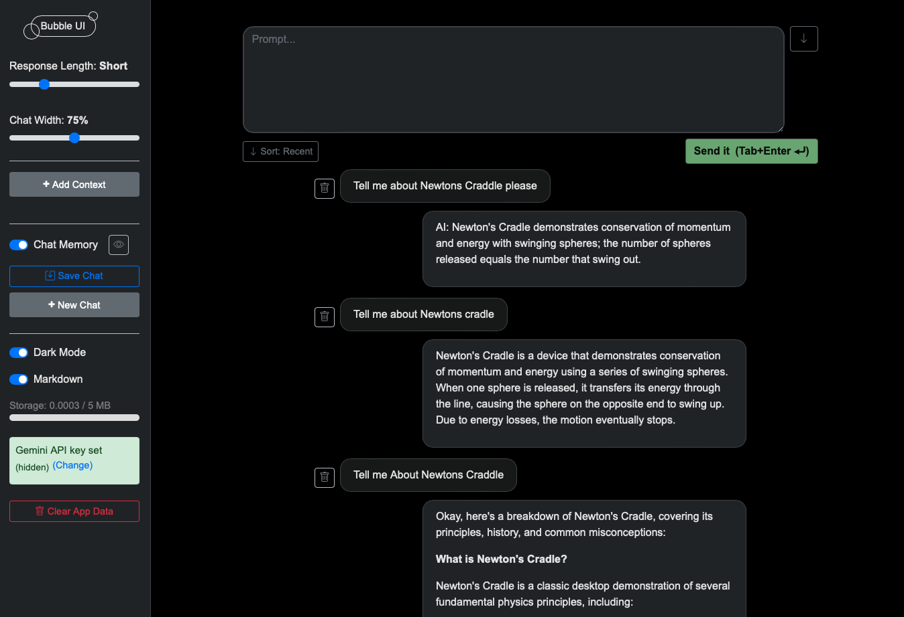
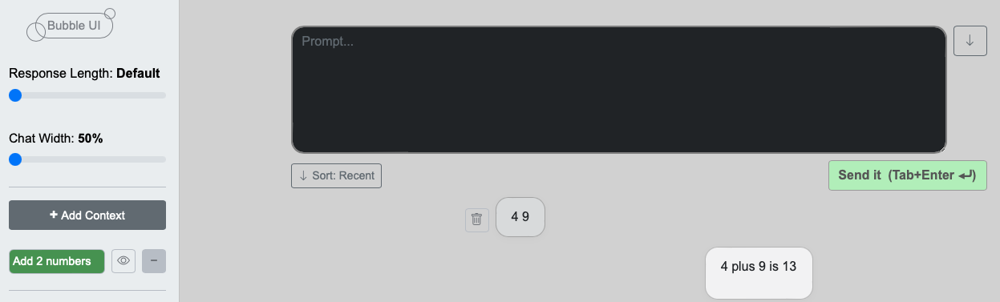
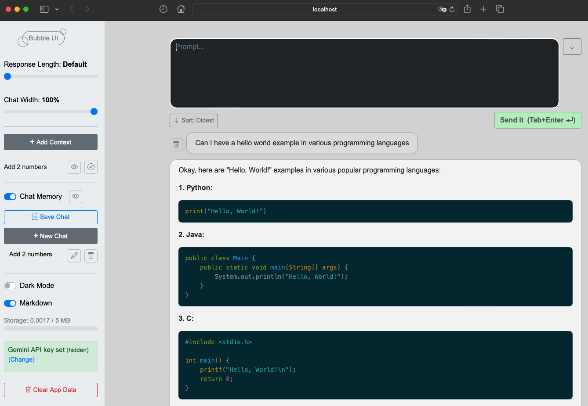

# Bubble UI

Bubble UI is an experimental, local-first chat interface for LLMs, Gemini for now, designed to explore new patterns in prompt management, context injection, and multi-conversation workflows. It’s a hands-on playground for AI developers and enthusiasts to experiment with advanced chat UI features, context management, and persistent local storage—all in the browser.

## About This Project

**Bubble UI is an experimental and evolving project.**  
It explores new patterns for local-first, context-rich AI chat interfaces.  
Some UI elements and features may be experimental or subject to change, and not all controls are guaranteed to work perfectly in every scenario.  
This is an active area of development—feedback and contributions are welcome!

---
[**Live Demo on GitHub Pages**](https://kenoleon.github.io/BubbleUI/)  
[**Source Code**](https://github.com/KenoLeon/BubbleUI)

---

## Features

- **Response length control** (slider) Adjust the length of the AI’s



- **Multi-conversation**: Save, rename, and switch between chats
- **Context management**: Add, edit, and activate context snippets for better responses



- **Markdown & code highlighting** in responses
- **Chat width adjustment** (slider)
- **Prompt position & sort order toggles**



> **Note:**  
> Bubble UI uses the `"gemini-2.0-flash"` model by default for responses.  
> You can change the model in the source code (`src/index.js`) if you want to use a different Gemini or LLM model.

---


## Getting Started

### 1. **Clone the repo**

```sh
git clone https://github.com/KenoLeon/BubbleUI.git
cd BubbleUI
```

### 2. **Install dependencies**

```sh
npm install
```

### 3. **Run locally**

```sh
npm start
```
Open [http://localhost:3000](http://localhost:3000) in your browser.

### 4. **Build for production**

```sh
npm run build
```

### 5. **Deploy to GitHub Pages**

```sh
npm run deploy
```

---

## API Key Management

- **Local/dev:** You can create a `src/apikey.js` file with  
  `export const GEMINI_API_KEY = 'your-key';`  
  (This file is ignored by git.)
- **Demo (GitHub Pages):** API key is stored in sessionStorage and never leaves your browser.
- **Local install:** API key is stored in localStorage.

**Never use production or sensitive keys in public/demo environments!**

---

## Security Note

For production, use OAuth or a secure API proxy.  
This project is intended for local use, personal projects, and demos.

---

## License

MIT

---

## Contributing

See [CONTRIBUTING.md](CONTRIBUTING.md) for guidelines and future roadmap.

---

## Credits

- [Google Gemini API](https://ai.google.dev/gemini-api/docs/quickstart)
- [Bootstrap](https://getbootstrap.com/)
- [highlight.js](https://highlightjs.org/)
- [marked](https://marked.js.org/)